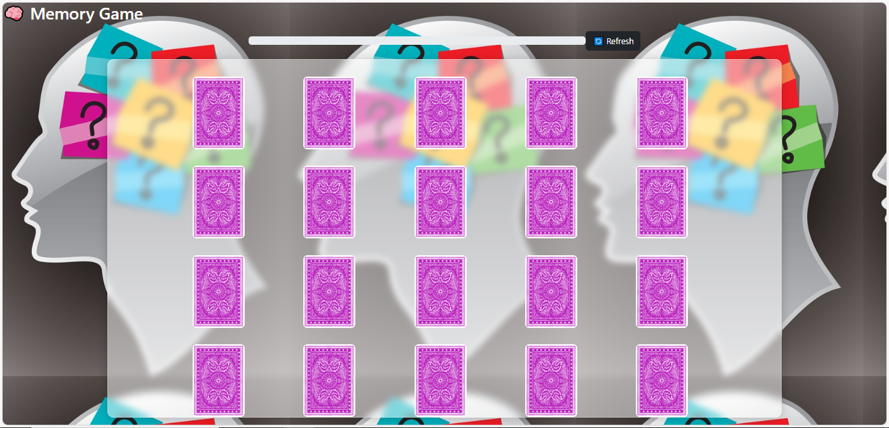
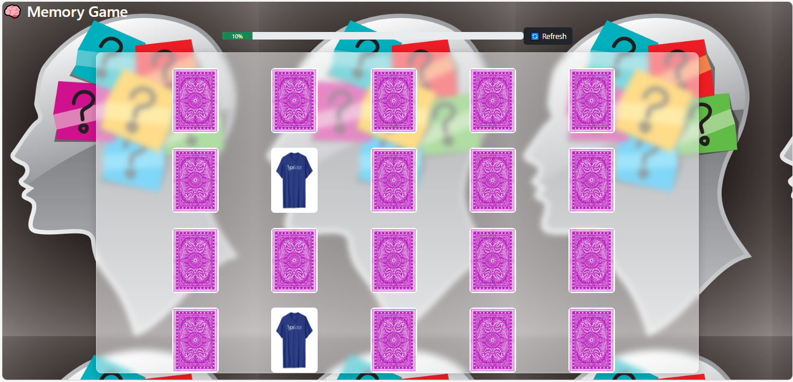

# 🧠 Memory Game

A simple and fun **Memory Card Matching Game** built with **TypeScript, HTML, CSS, and Bootstrap**.  
Flip the cards, test your memory, and try to match all pairs before time runs out! 🎉

---

## 🚀 Features
- 🎨 Responsive UI with **Bootstrap 5**.
- 🔊 Sound effects for flip, success, fail, win, and game-over.
- 📈 Progress bar that updates as you find matches.
- 🔄 Refresh button to restart the game at any time.
- 🖼️ Smooth 3D flip animation with CSS.

---

## 🛠️ Technologies Used
- **TypeScript**
- **HTML5**
- **CSS3** (with animations & blur effects)
- **Bootstrap 5**
- **Bootstrap Icons**

---

## 🖼️ Screenshots

  
  

